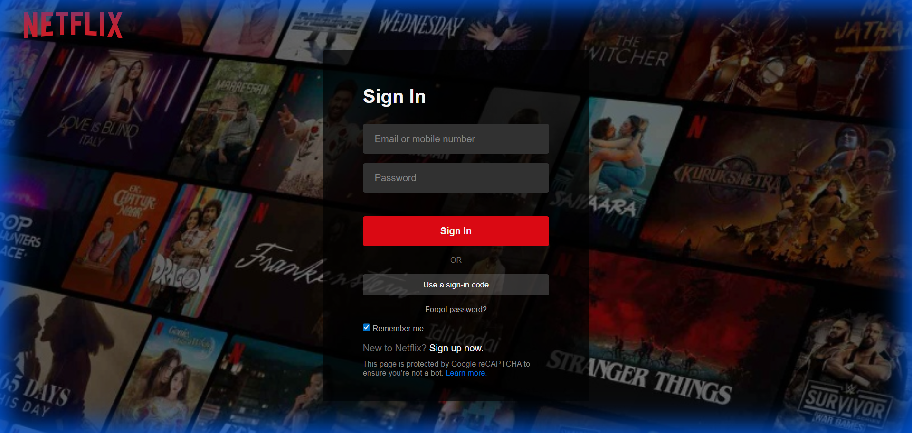

# 🎬 Netflix Clone (Login & Dashboard)

A pixel-perfect responsive replica of the Netflix login and landing interface. This full-stack web application features a polished **React** frontend and a dedicated **Express** backend for handling authentication logic. Designed to mimic the premium aesthetic of the original platform.

## 📸 Interface Preview



## 🌐 Live Demo

**Experience the app live on Vercel:**
👉 **[View Live Demo](https://movie-loginpage.vercel.app/)** *(Replace with your specific Vercel URL)*

## ✨ Features

*   **Responsive UI**: Fully responsive design that looks accurate on mobile, tablet, and desktop.
*   **Authentication Flow**:
    *   Functional login form with credential validation.
    *   Express.js backend API handling sign-in requests.
    *   **Secure Dashboard**: Accessible only after successful authentication.
*   **Modern Styling**:
    *   Custom CSS implementation (no external UI libraries).
    *   Floating input labels.
    *   Authentic Netflix red/black color scheme and typography.
*   **Sign Out Functionality**: Complete session lifecycle management.

## 🔐 Credentials for Testing

Use the following credentials to access the secure dashboard:

| Role | Email | Password |
| :--- | :--- | :--- |
| **User** | `loki@gmail.com` | `loki123` |
| **Test** | `test@netflix.com` | `password123` |

## 🛠️ Tech Stack

*   **Frontend**: React (Vite), React Router v6
*   **Backend**: Node.js, Express.js
*   **Styling**: Vanilla CSS3 (Custom Design System)

## 🚀 Getting Started

### 1. Clone the repository
```bash
git clone https://github.com/Lokistark/Movie-LoginPage.git
cd Movie-LoginPage
```

### 2. Install Dependencies

You need to install dependencies for both the client (frontend) and server (backend).

**Frontend:**
```bash
cd client
npm install
```

**Backend:**
```bash
cd server
npm install
```

### 3. Run the Application

You need to run both the backend server and frontend client simultaneously.

**Start the Backend (Port 5000):**
```bash
# In the /server directory
npm start
```

**Start the Frontend (Port 5173):**
```bash
# In the /client directory
npm run dev
```

The application will launch at `http://localhost:5173`.
n